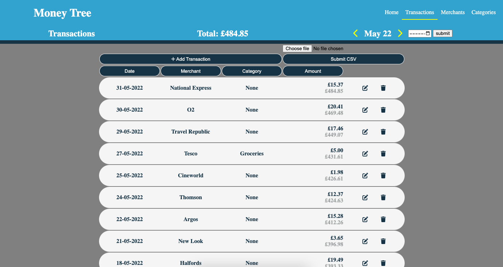
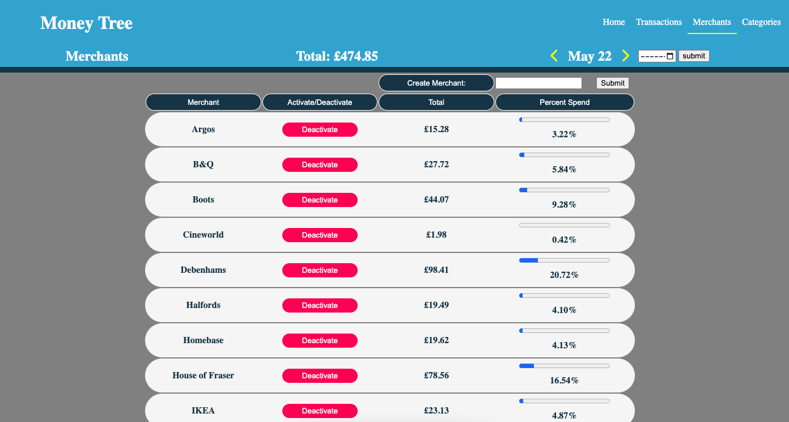
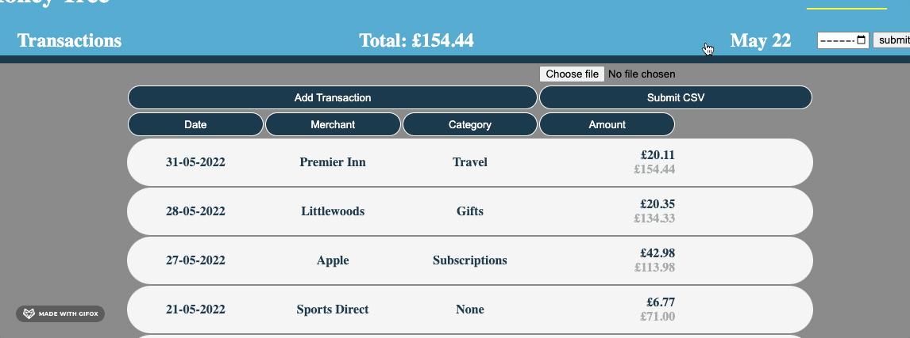
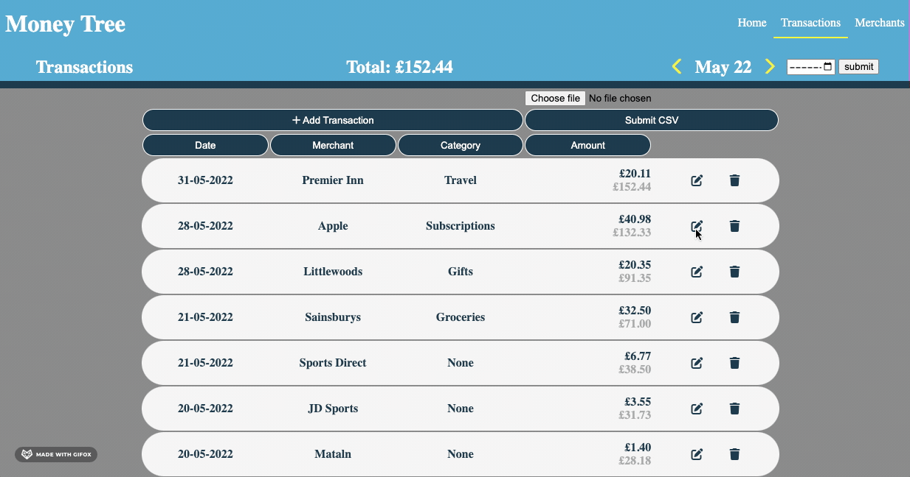

# Money Tree - Spending Tracker App
PostgreSQL | Psycopg2 | Python | Flask | Jinja | HTML | CSS

---

---
[Project Brief](documents/projects.md)
#### Description:
A Python/Flask/SQL based CRUD app with RESTful routes. 

The app is designed to allow a user to Add/Edit/Delete and categorise transactions.
The transactions contain relevant information as they would be found on a bank statement (date, merchant and amount) as well as a user defined category.

The user can cycle through month by month to see their expenditure.

They can also edit the transactions as they see fit.

The Transaction table can be sorted by date, merchant, category, amount. It can also be filtered by merchant and category to determine individual expenditure.

Merchants and categories can be activated/deactivated to remove them from the calculations. This design decision was taken over deletion as this could negatively impact historic transactions that have been assigned.

In addition to adding transactions manually, there is an option to import a CSV file with bulk transactions. (Complex CSV statement parsing was beyond the scope of the project, so an example file with dummy data was used.)

There is CSV dummy data generator in the CSV folder if you would like to test the app and its functionality. Installation instructions can be found below.

##### Features Summary:

- Add/Remove/Edit Transactions In-place
- Add/Disable/Edit Merchants
- Add/Disable/Edit Spending Categories
- View transactions and navigate by month
- Custom sort & filter of transaction tables
- Spend Analysis: Transaction running totals, Category/Merchant totals and  percentage spend.
- CSV Import
---

#### Installation:

##### Modules & Dependencies:
    - Python (3.9.10)
      - Unittest
      - Datetime
      - Random 
      - CSV 
    - Dateutil (2.8.2)
    - Flask (2.1.1)
    - Psycopg2 (2.9.3)
    - Jinja2 (3.1.1)
    - psql (14.2)

---

You may need install the above modules.

1. To set up the database run the following terminal commands in the project directory.  This will create and link a database to our project and create the relevant SQL Tables. `createdb spending_tracker` `psql -d spending_tracker -f db/spending_tracker.sql`  
2. In the main project file, start flask with the command below. The server is set up to display the site on localhost:5000 this can be reached with the following link: [visit localhost](http://127.0.0.1:5000/) `flask run`
 
3. You should have arrived on the homepage. Navigate to the Transactions page in the top right hand corner. There will be no data in the app at this point. You can choose to add/edit/delete as you please or you can add dummy-data by following the steps below.   
4. To add CSV data you will first need to generate CSV file. In the CSV folder a python file named `makecsv.py` is set up to generate 100 transactions within a year, from random UK retailers and a random amount between £0.01 and £100. The file is set up so that you can easily edit these parameters if you wish. To generate the data simply run the file `python3 makecsv.py`.  To add the data into the project select choose file on the app and when prompted: find the project directory on your machine. The dummy-data file will now be in the CSV folder alongside the python script as `example.csv`. Depending on the file size this may take a few seconds to load.  
5. You should now have transactions that you can categorise and view the full features of the app. 